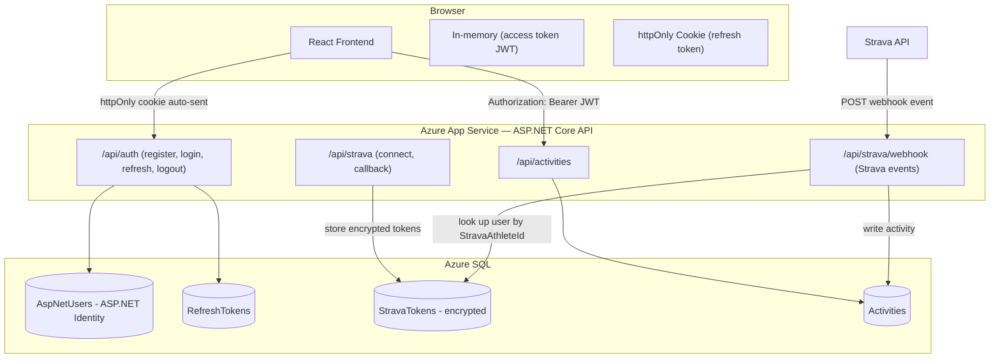
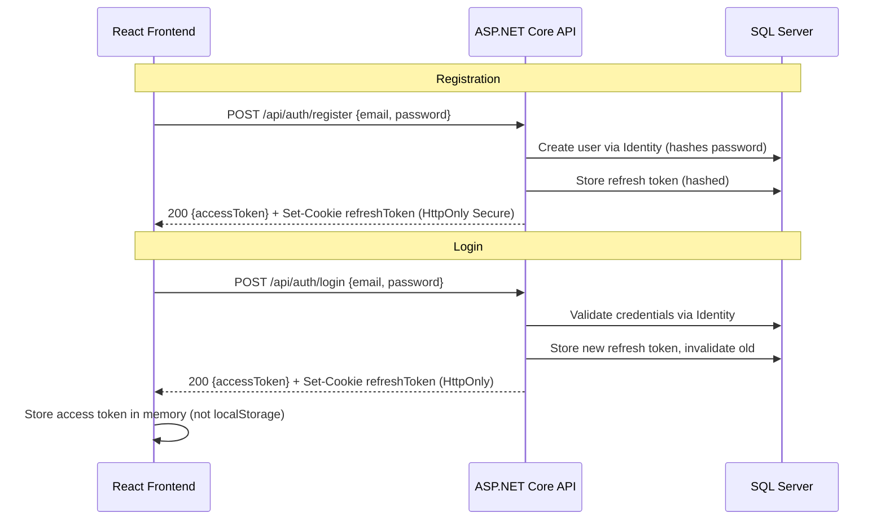
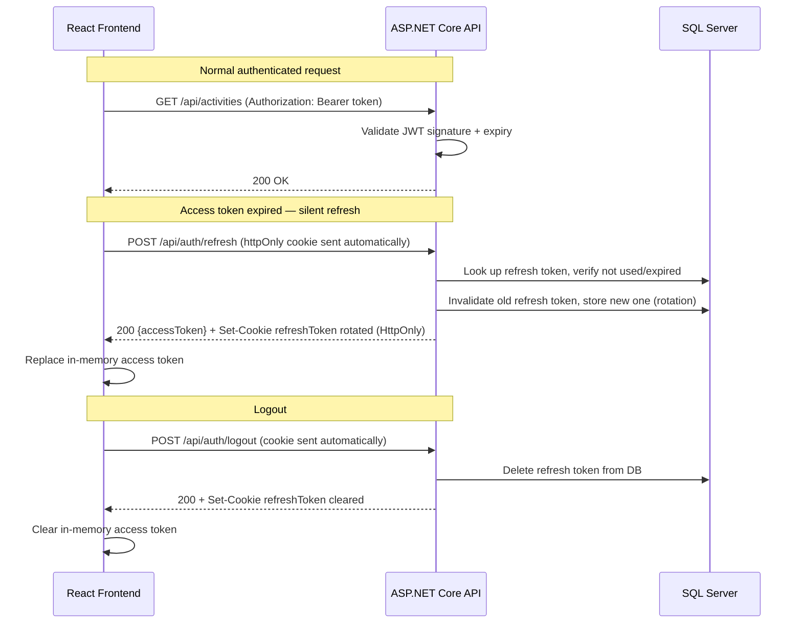
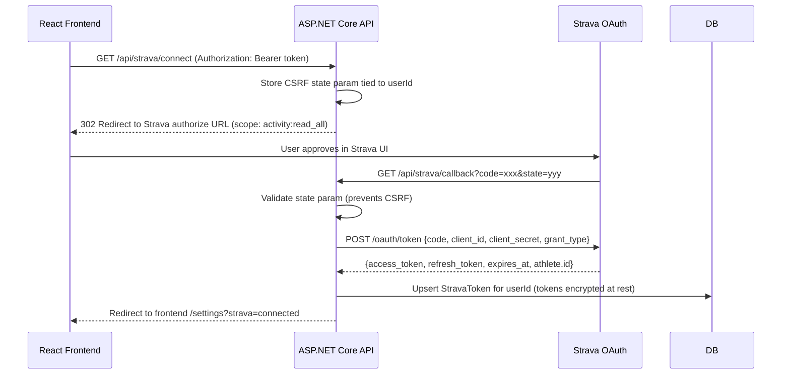
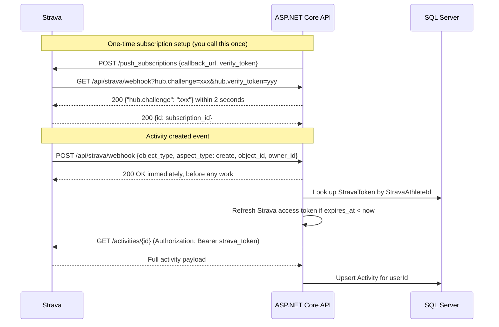

# Auth & User Architecture

## Recommendation: ASP.NET Core Identity + JWT

The app uses **ASP.NET Core Identity** for user accounts (email/password) and **JWT bearer tokens** for API authentication. This is the idiomatic .NET approach — it integrates directly with EF Core, handles password hashing and account management out of the box, and keeps everything self-hosted with no external identity service costs.

The existing `Microsoft.Identity.Web` (Entra ID) setup is replaced for end-user auth. Entra ID B2C and services like Auth0 add cost and complexity without meaningful benefit at this scale.

Strava is connected as a **linked OAuth account** after the user has already registered — it is not the primary identity provider.

---

## System Overview



---

## Flow 1: Registration & Login



The refresh token is delivered via an **httpOnly cookie** — JavaScript cannot read it, so XSS attacks cannot steal it. The access token lives only in memory and is gone on page refresh, which is an acceptable UX tradeoff for the security gain.

---

## Flow 2: JWT Token Lifecycle

Access tokens are short-lived (15 minutes). The frontend silently refreshes before expiry.



**Refresh token rotation**: every refresh issues a new token and invalidates the old one. If a stolen token is used twice, the second use detects reuse and invalidates the entire token family.

---

## Flow 3: Strava Account Linking

This happens after the user is already logged in.



Scope `activity:read_all` is required to receive private activity events through the webhook.

**Strava token details:**
- Access tokens expire after **6 hours**
- Refresh tokens are **rotated** — each refresh response may return a new refresh token; always persist the latest one
- Check `expires_at` before every Strava API call and refresh proactively if needed

---

## Flow 4: Webhook → Activity Ingestion

Strava uses a single webhook subscription per app — one event fires for every athlete who has connected their account.



**Critical**: return `200 OK` to Strava immediately, then do the fetch-and-store work asynchronously. Strava retries up to 3 times if no response within 2 seconds. Use a background queue (e.g. `IHostedService` + `Channel<T>`) for the async work.

---

## Data Model

```
AspNetUsers                         ← managed by ASP.NET Identity
├── Id              GUID
├── Email           NVARCHAR(256)
├── PasswordHash    NVARCHAR(MAX)
└── ...             (standard Identity columns)

RefreshTokens
├── Id              GUID
├── UserId          FK → AspNetUsers.Id
├── TokenHash       NVARCHAR(256)   ← store hash, never plaintext
├── ExpiresAt       DATETIME2
├── CreatedAt       DATETIME2
└── RevokedAt       DATETIME2?      ← null = still valid

StravaTokens
├── UserId          FK → AspNetUsers.Id   (unique — one Strava account per user)
├── StravaAthleteId BIGINT               ← used to match incoming webhook events
├── AccessToken     NVARCHAR(MAX)        ← encrypted via Data Protection API
├── RefreshToken    NVARCHAR(MAX)        ← encrypted via Data Protection API
└── ExpiresAt       DATETIME2

Activities
├── Id              INT IDENTITY
├── UserId          FK → AspNetUsers.Id  ← add this (currently missing)
├── StravaActivityId BIGINT?             ← link back to source activity on Strava
└── ... (existing columns)
```

---

## Changes to Existing Codebase

| Area | Change |
|---|---|
| `Program.cs` | Replace Entra ID auth with JWT bearer; keep `DevBypass` for local dev |
| DB schema | Add `AspNetUsers`, `RefreshTokens`, `StravaTokens`; add `UserId` FK to `Activities` |
| New controllers | `AuthController` (register/login/refresh/logout), `StravaController` (connect/callback/webhook) |
| New services | `TokenService` (issue/validate JWTs), `StravaTokenService` (store/refresh Strava tokens) |
| `ActivityService` | Scope all queries to `UserId` — users must only see their own activities |
| Config | Add `Jwt:Secret`, `Jwt:Issuer`, `Strava:ClientId`, `Strava:ClientSecret`, `Strava:WebhookVerifyToken` to user secrets |

---

## Security Checklist

- **Never store JWT secret in appsettings** — use User Secrets locally, Key Vault in Azure
- **Encrypt Strava tokens at rest** — use ASP.NET Data Protection API on those columns
- **Validate CSRF state param** in the Strava OAuth callback
- **Scope `Activities` queries to the authenticated user** — never return another user's data
- **Refresh token rotation + reuse detection** — invalidate the entire token family on reuse
- **Webhook verify token** — reject webhook requests that don't present the expected verify token
