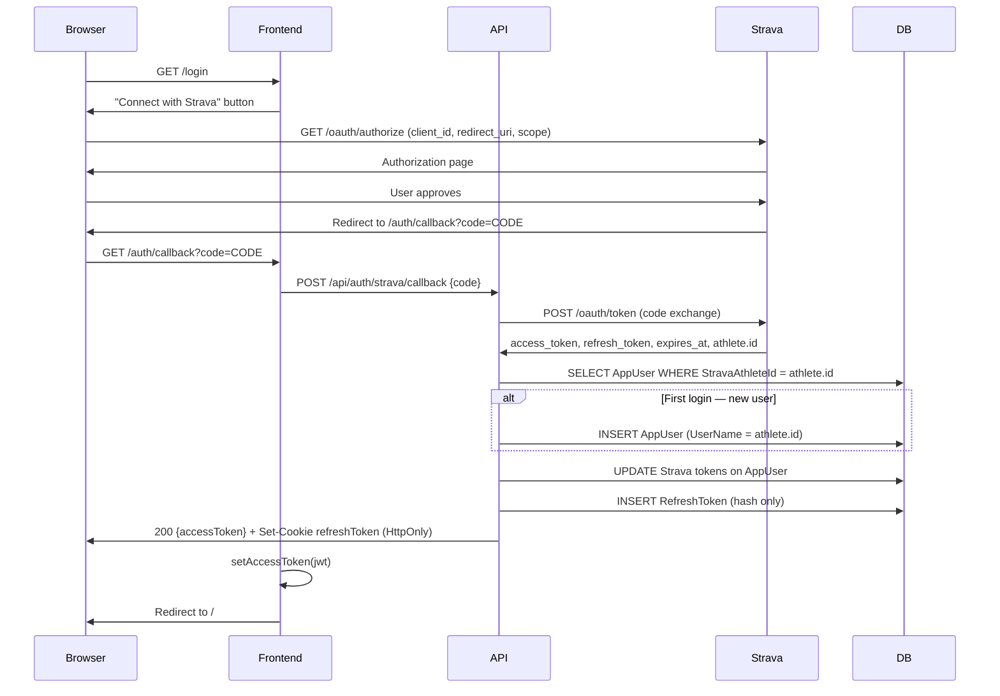
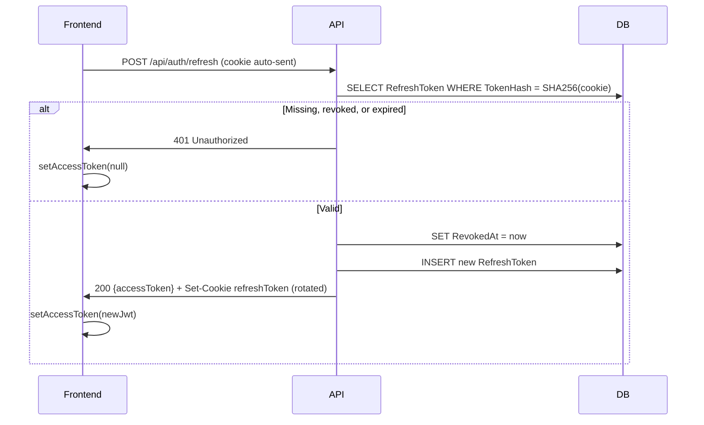
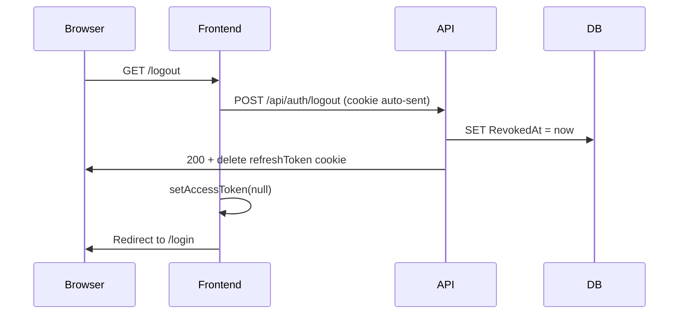

# Authentication

## Overview

Strava is the identity provider — there are no local passwords. Every user identity is anchored to a Strava athlete ID. The app issues its own short-lived JWTs for API access and a long-lived HttpOnly refresh token cookie for session continuity.

The OAuth 2.0 authorization code flow works as follows: the frontend redirects the user to Strava, Strava redirects back to the frontend with an authorization code, the frontend sends the code to the backend, and the backend exchanges it with Strava (using the client secret) before issuing app tokens.

---

## Dependencies

| Package | Purpose |
|---|---|
| `Microsoft.AspNetCore.Identity.EntityFrameworkCore` | `AppUser` entity, EF schema, `UserManager<AppUser>` for user creation |
| `System.IdentityModel.Tokens.Jwt` | JWT generation in `TokenService` |
| `Microsoft.AspNetCore.Authentication.JwtBearer` | JWT validation middleware (production only — bypassed in Development) |

No Strava SDK is used. The token exchange is a single `HttpClient` POST to `https://www.strava.com/oauth/token`.

---

## Token design

### App access token (JWT)
- **Lifetime**: 15 minutes
- **Transport**: `Authorization: Bearer <token>` request header
- **Storage**: module-scoped variable in `src/lib/api.ts` — never `localStorage` or `sessionStorage` (XSS mitigation)
- **Lost on page refresh**: re-hydrated by calling `/api/auth/refresh` on app load

### App refresh token
- **Lifetime**: 7 days
- **Transport**: `HttpOnly; SameSite=Strict` cookie named `refreshToken`
- **Storage**: SHA-256 hash stored in the `RefreshTokens` table — the raw token is never persisted
- **Rotation**: old token revoked before a new one is issued on every refresh

### Strava tokens
- Stored directly on `AppUser` (`StravaAccessToken`, `StravaRefreshToken`, `StravaTokenExpiresAt`)
- Updated on every login
- Not used for app auth — reserved for future Strava API calls on behalf of the user

---

## Data model

```
AspNetUsers                          managed by ASP.NET Identity
├── Id                  string       GUID — FK target for RefreshTokens
├── UserName            string       Strava athlete ID as string
├── PasswordHash        string       always NULL — no local passwords
├── StravaAthleteId     long?
├── StravaAccessToken   string?
├── StravaRefreshToken  string?
└── StravaTokenExpiresAt datetime?

RefreshTokens
├── Id          Guid
├── UserId      string       FK → AspNetUsers.Id
├── TokenHash   string       SHA-256 of raw token — plaintext never stored
├── ExpiresAt   datetime
├── CreatedAt   datetime
└── RevokedAt   datetime?    NULL = still valid
```

---

## Login / Register

The same flow handles both new and returning users. A new `AppUser` is created on first login (register); subsequent logins update the stored Strava tokens.



---

## Token refresh

The access token lives in memory and is lost on page refresh. The frontend calls `/api/auth/refresh` on app load, and the Axios response interceptor calls it automatically on any 401.



---

## Logout



---

## Security notes

- **`Jwt:Secret` must not be in `appsettings.json`** — use user secrets locally, App Service environment variable in Azure.
- **Strava tokens are stored in plaintext** on `AppUser`. Add ASP.NET Data Protection API encryption before shipping to real users.
- **Refresh token rotation** means a stolen cookie can only be replayed once. If the legitimate user refreshes first, the stolen token has no matching active hash in the DB and gets a 401.
- **Activities are not yet scoped to `UserId`** — all users see all activities (known issue).

---

## Key files

| File | Role |
|---|---|
| `StravaEditBotApi/Controllers/AuthController.cs` | `POST /api/auth/strava/callback`, `/refresh`, `/logout` |
| `StravaEditBotApi/Services/StravaAuthService.cs` | Strava token exchange via `HttpClient` |
| `StravaEditBotApi/Services/TokenService.cs` | JWT generation, refresh token generation, SHA-256 hashing |
| `StravaEditBotApi/Models/AppUser.cs` | `IdentityUser` + Strava token fields |
| `StravaEditBotApi/Models/RefreshToken.cs` | Refresh token record (hash, expiry, revocation) |
| `strava-edit-bot-ui/src/lib/api.ts` | Axios instance — Bearer token interceptor and 401-to-refresh retry |
| `strava-edit-bot-ui/src/routes/login.tsx` | "Connect with Strava" button |
| `strava-edit-bot-ui/src/routes/auth/callback.tsx` | Receives OAuth code, calls backend, stores token |
| `strava-edit-bot-ui/src/routes/logout.tsx` | Calls logout endpoint, clears token, redirects |
