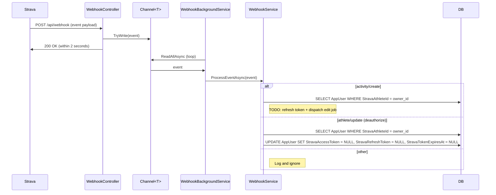
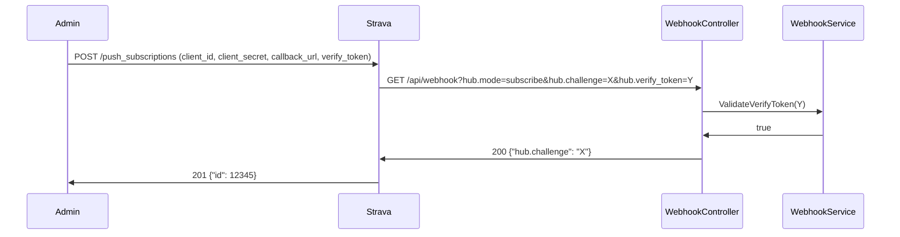

# Webhooks

## Overview

Strava webhooks push real-time events to the app when athletes upload, update, or delete activities — and when they revoke access. The app does not store activity data locally. When an `activity create` event arrives, the webhook triggers an edit job that modifies the activity in place via the Strava API. One subscription covers all users who have authorized the app.

---

## Event types

| `object_type` | `aspect_type` | App behavior |
|---|---|---|
| `activity` | `create` | Look up user, dispatch edit job (TODO) |
| `activity` | `update` | Ignored |
| `activity` | `delete` | Ignored |
| `athlete` | `update` (`"authorized": "false"`) | Revoke stored Strava tokens |

---

## Data flow

### Event processing



### Subscription handshake (one-time)



---

## Configuration

| Key | Where to set | Purpose |
|---|---|---|
| `Strava:ClientId` | `appsettings.json` (non-secret) | Strava app client ID |
| `Strava:ClientSecret` | User secrets / Azure env var | Strava app client secret |
| `Strava:WebhookVerifyToken` | User secrets / Azure env var (`Strava__WebhookVerifyToken`) | Shared secret for handshake validation — you choose this value |

Set user secrets locally:

```bash
cd StravaEditBotApi
dotnet user-secrets set "Strava:WebhookVerifyToken" "any-secret-string-you-choose"
```

---

## Local development

### Simulating events with Bruno (no Strava needed)

The Bruno collection has a `webhook/` folder with ready-made requests for every event type. Set two variables in the **local** environment in Bruno before using them:

| Variable | Value | Notes |
|---|---|---|
| `stravaAthleteId` | Your test user's Strava athlete ID | Find in `AspNetUsers.StravaAthleteId` after logging in once |
| `webhookVerifyToken` | Same value as `Strava:WebhookVerifyToken` user secret | Stored as a Bruno secret variable — not committed |

Available requests:

| Request | What it tests |
|---|---|
| `webhook/validate-handshake` | `GET /api/webhook` — subscription handshake |
| `webhook/activity-create` | `POST /api/webhook` — new activity uploaded |
| `webhook/activity-update-title` | `POST /api/webhook` — title changed |
| `webhook/activity-delete` | `POST /api/webhook` — activity deleted |
| `webhook/athlete-deauthorize` | `POST /api/webhook` — athlete revokes access |

### End-to-end testing with ngrok

When you need to test with a real Strava account, expose the local API:

```bash
ngrok http 5247
# gives: https://abc123.ngrok.io
```

Then register the subscription (see Production setup below), using the ngrok URL as the callback. The ngrok URL changes on each restart, requiring re-subscription each time (delete old, create new).

---

## Production setup

### 1. Deploy

Deploy the API with the webhook endpoint accessible at `https://<your-api-host>/api/webhook`.

### 2. Set configuration

In Azure App Service → Configuration → Application settings:

```
Strava__WebhookVerifyToken = <your-chosen-secret>
```

### 3. Register the subscription

One subscription per Strava app. This is a one-time operation.

```bash
curl -X POST https://www.strava.com/api/v3/push_subscriptions \
  -d client_id=YOUR_CLIENT_ID \
  -d client_secret=YOUR_CLIENT_SECRET \
  -d callback_url=https://YOUR_API_HOST/api/webhook \
  -d verify_token=YOUR_WEBHOOK_VERIFY_TOKEN
```

Strava immediately hits `GET /api/webhook` with the handshake. On success, the response contains the subscription ID:

```json
{ "id": 12345 }
```

### 4. Verify

```bash
curl "https://www.strava.com/api/v3/push_subscriptions?client_id=YOUR_CLIENT_ID&client_secret=YOUR_CLIENT_SECRET"
```

Returns an array with your subscription.

### 5. Re-registration (if callback URL changes)

Delete the old subscription first:

```bash
curl -X DELETE "https://www.strava.com/api/v3/push_subscriptions/12345?client_id=YOUR_CLIENT_ID&client_secret=YOUR_CLIENT_SECRET"
```

Then create a new one (step 3).

---

## Deauthorization

When an athlete revokes access to the app on Strava, a webhook event fires:

```json
{
  "object_type": "athlete",
  "object_id": 134815,
  "aspect_type": "update",
  "updates": { "authorized": "false" },
  "owner_id": 134815,
  "subscription_id": 12345,
  "event_time": 1516126040
}
```

The app responds by:

1. Clearing all Strava data on the user (`StravaAccessToken`, `StravaRefreshToken`, `StravaTokenExpiresAt`, `StravaFirstname`, `StravaLastname`, `StravaProfileMedium`, `StravaProfile`)
2. Revoking all active app refresh tokens — this forces the user out of any active sessions
3. Keeping `StravaAthleteId` intact — this is the link that lets re-authorization find the same `AppUser` instead of creating a duplicate account

After deauthorization, the user can re-authorize by going through the normal Strava OAuth flow again. The existing `AuthController.StravaCallbackAsync` handles this: it finds the user by `StravaAthleteId` and repopulates all Strava fields.

---

## Security notes

- **`WebhookVerifyToken` is a secret** — never commit it to `appsettings.json`. Set it in user secrets (dev) or Azure env var (prod).
- **Webhook endpoints are unauthenticated** (`[AllowAnonymous]`) — Strava does not sign payloads. The `verify_token` handshake is the only authentication, and it only runs once during subscription creation. After that, anyone who knows the callback URL can send fake events.
- **Strava retries** up to 3 times if the endpoint doesn't respond with 200 within 2 seconds. The `Channel<T>` queue ensures the response is immediate; all processing happens asynchronously.
- **Events lost during downtime are not recoverable** — acceptable for this project. If the App Service restarts, in-flight events in the channel are lost. The in-memory channel has no durability guarantee.

---

## Key files

| File | Role |
|---|---|
| `StravaAPILibrary/API/Webhooks.cs` | Strava subscription management (create/get/delete) |
| `StravaEditBotApi/DTOs/StravaWebhookEventDto.cs` | Typed record for Strava webhook event payload |
| `StravaEditBotApi/Controllers/WebhookController.cs` | `GET /api/webhook` (handshake), `POST /api/webhook` (event receiver) |
| `StravaEditBotApi/Services/IWebhookService.cs` | Webhook service interface |
| `StravaEditBotApi/Services/WebhookService.cs` | Token validation, event dispatch, deauthorization |
| `StravaEditBotApi/Services/WebhookBackgroundService.cs` | Background event processor (reads from channel) |
| `StravaEditBotApi/Program.cs` | Channel + service DI registration |
| `bruno/webhook/` | Bruno requests for local testing |
